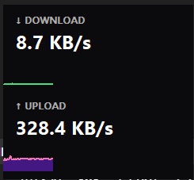

# NetFlux 🚀




**NetFlux** is a lightweight, high-performance network speed monitor for Windows 11/10 that lives in your System Tray. It provides real-time download/upload statistics with minimal resource usage, built using native Windows GDI and Rust.

## ✨ Features

- **Real-time Monitoring**: Updates network speed every second.
- **Tray Integration**: Displays current download speed directly in the tray icon.
- **Detailed Popup**: Click the tray icon to see a graph of Download and Upload history.
- **Native Performance**: Written in Rust using WinAPI (GDI) for near-zero CPU/RAM usage.
- **Autostart**: Automatically starts with Windows (Registry integration).
- **Customizable View**: Toggle between All, Download Only, or Upload Only modes.

## 📥 Installation

### Option 1: Download Binary (Recommended)
1. Go to the [Releases](https://github.com/justrawaccel/netflux/releases) page.
2. Download the latest `netflux.zip`.
3. Extract the archive.
4. Run `netflux.exe`.

### Option 2: Build from Source
Ensure you have [Rust](https://www.rust-lang.org/tools/install) installed.

```powershell
# Clone the repository
git clone https://github.com/justrawaccel/netflux.git
cd netflux

# Build for release
cargo build --release

# Run
./target/release/netflux.exe
```

## 🛠️ Usage

- **Left Click**: Toggle the detailed graph popup.
- **Right Click**: Open context menu (Change View Mode, Exit).
- **Hover**: See a tooltip with current Download and Upload speeds.

## 📄 License

This project is licensed under the MIT License - see the [LICENSE](LICENSE) file for details.
